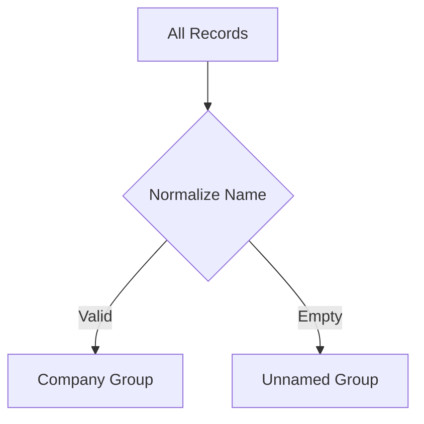
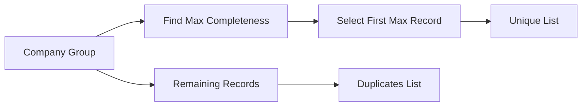
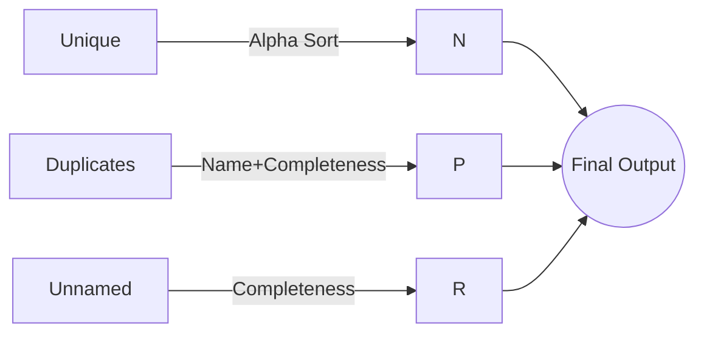

My solution for Veridion (#3) Entity Resolution assignment.

```markdown
# Parquet Data Processor

A Java utility for processing company records in Parquet files with smart deduplication and sorting based on data completeness and normalized company names.

## Table of Contents
- [Core Features](#core-features)
- [Key Concepts](#key-concepts)
- [Algorithm Steps](#algorithm-steps)
- [Usage Examples](#usage-examples)
- [Installation](#installation)


## Core Features

- **Smart Sorting**:
  - Primary: Normalized company name (ASCII-folded, lowercase)
  - Secondary: Record completeness score (descending)
- **Deduplication**:
  - Maintains most complete record per company
  - Identifies duplicates with lower completeness
- **Special Handling**:
  - Records without company names sorted last
  - Configurable compression (Snappy default)
- **Efficient I/O**:
  - Stream-based processing
  - Type-safe Avro integration

## Key Concepts

### Normalization Pipeline
```plaintext
Raw Name → Lowercase → Trim → Remove Special Chars → ASCII-fold
Example: "  Big-Tech, Inc. " → "bigtechinc"
```

### Completeness Score
Calculates data quality metric:
```java
// For each field in schema:
if (record.get(field) != null) score++;
```

## Algorithm Steps

1. **Group Records**


2. **Process Groups**


3. **Final Sort Order**


## Usage Examples

### Basic Processing
```java
// Read and process
List<GenericRecord> records = ParquetProcessor.readParquetFile("input.parquet");
List<GenericRecord> sorted = ParquetProcessor.sortRecordsWithUniqueFirst(records);

// Write result
ParquetProcessor.writeParquetFile(sorted, "processed.parquet");
```

### Advanced Splitting
```java
ParquetProcessor.SplitResult result = ParquetProcessor.splitIntoUniqueAndDuplicates(records);

System.out.println("Clean records: " + result.getUniqueRecords().size());
System.out.println("Duplicates: " + result.getDuplicateRecords().size());
```

**Optimizations**:
- Stream-based processing
- Early completeness calculation caching
- Hash-based grouping (O(n) complexity)

## Installation

**Requirements**:
- Java 11+
- Maven dependencies:

```xml
<dependencies>
    <dependency>
        <groupId>org.apache.parquet</groupId>
        <artifactId>parquet-avro</artifactId>
        <version>1.12.3</version>
    </dependency>
    <dependency>
        <groupId>org.apache.hadoop</groupId>
        <artifactId>hadoop-common</artifactId>
        <version>3.3.4</version>
    </dependency>
</dependencies>
```
